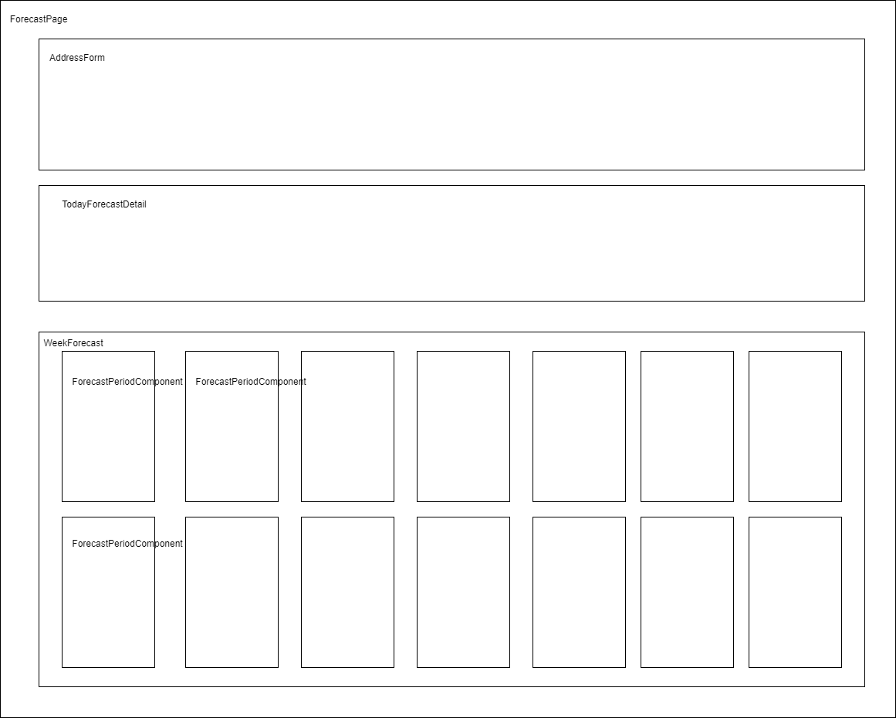
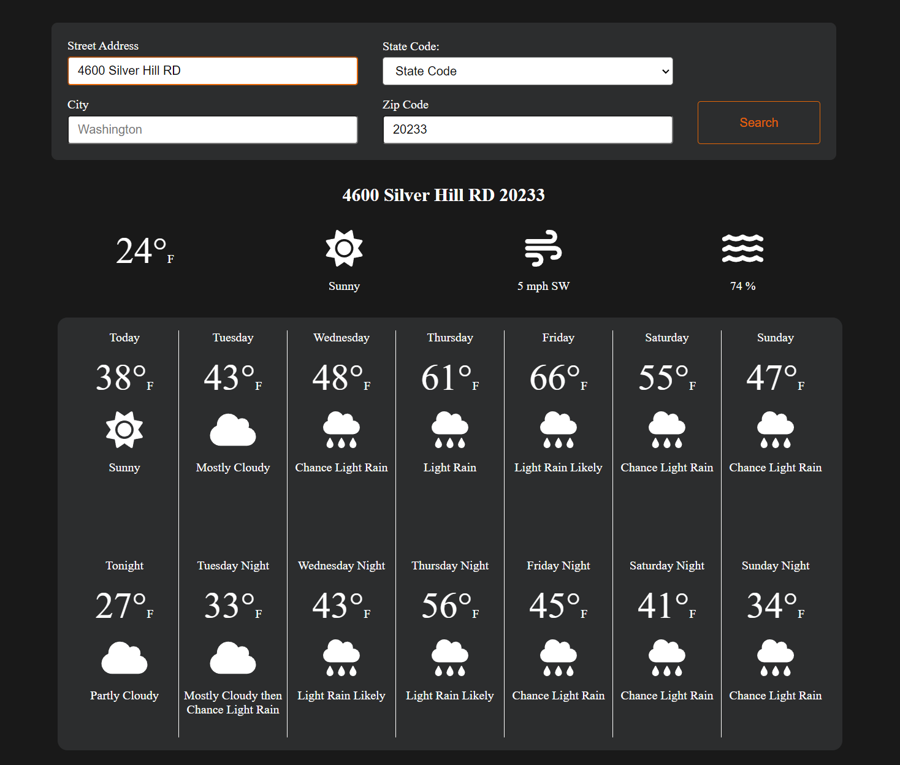

# WeatherApp Readme

## Description
WeatherApp is a weather application that provides real-time weather information. It consists of a backend built with .NET 8 and a frontend developed in React.

## Backend Setup

### Prerequisites
- [.NET 8 SDK](https://dotnet.microsoft.com/download/dotnet/8.0) must be installed on your system.

### Running the Backend
1. Clone the WeatherApp repository to your local machine.
2. Navigate to the `backend` directory within the WeatherApp repository.
3. Open a terminal or command prompt and run the following commands:
```bash
dotnet restore
```
```bash
dotnet run
```

4. The backend should now be running, and you can access it at `https://localhost:7032/swagger/index.html`. You can check the health of the API by visiting `https://localhost:7032/health`.

## Frontend Setup

### Prerequisites
- [Node.js](https://nodejs.org/) and [npm](https://www.npmjs.com/) must be installed on your system.

### Running the Frontend
1. Navigate to the `frontend` directory within the WeatherApp repository.
2. Open a terminal or command prompt and run the following commands:
```bash
npm install
```
```bash
npm start
```

3. The frontend development server should now be running, and you can access it at `http://localhost:3000`.

## Usage
- Once both the backend and frontend are running, you can access the WeatherApp by visiting `http://localhost:3000` in your web browser.
- You can use the application to search for real-time weather information for different addresses.

## Screenshots

### Wireframe


### WeatherApp Screenshot

